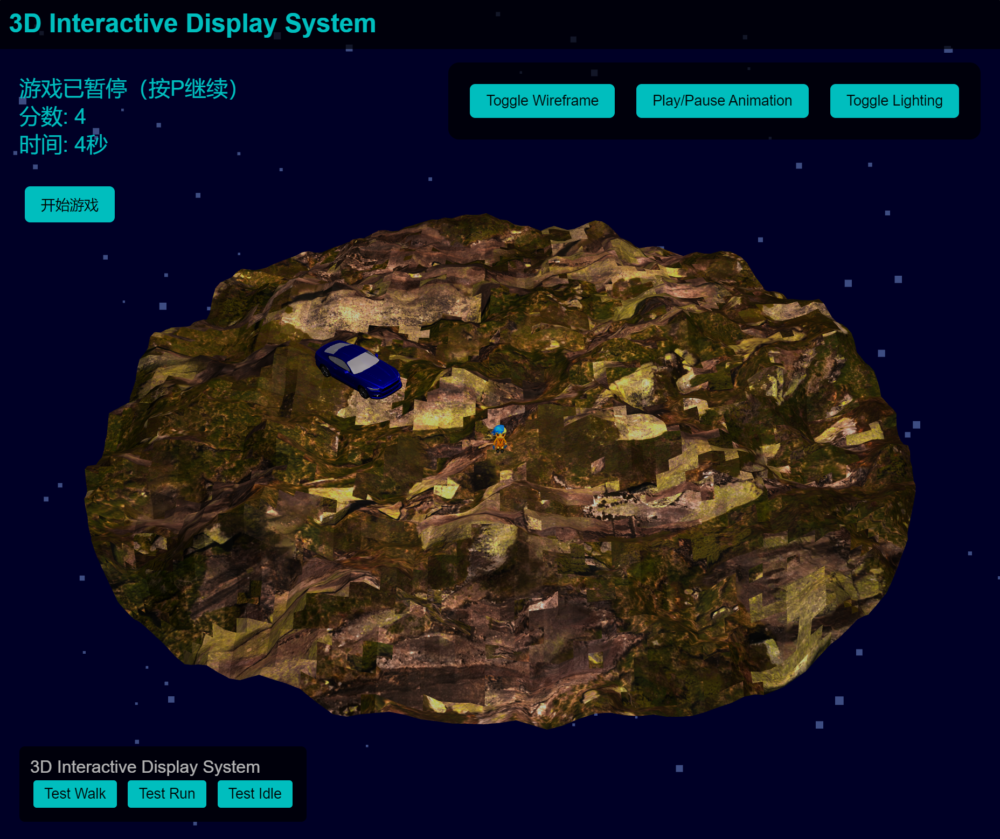

# 3D车追人游戏 - README

## 项目介绍

这是一个基于Three.js开发的3D互动汽车追逐游戏。玩家控制Eva角色在3D场景中躲避追逐的汽车，尽可能长时间生存以获得高分。游戏融合了3D模型展示、动画控制和互动游戏玩法。



## 功能特点

- 3D车辆和角色模型
- 圆形场景边界检测
- 动态光照系统
- 角色动画控制
- 键盘WASD/方向键移动
- 汽车AI追逐逻辑
- 分数计时系统
- 游戏暂停功能
- 线框模式切换
- 光照效果调整

## 技术栈

- Three.js (3D渲染引擎)
- GLTFLoader (3D模型加载)
- 原生JavaScript
- HTML5 / CSS3

## 快速开始

### 本地运行

1. **克隆项目**
   ```bash
   git clone https://github.com/yourusername/car-chase-game.git
   cd car-chase-game
   ```

2. **启动本地服务器**

   方法一：使用Node.js的http-server（推荐）
   ```bash
   # 安装http-server
   npm install -g http-server
   
   # 启动服务器
   http-server
   ```

   方法二：使用Python内置服务器
   ```bash
   # Python 3
   python -m http.server
   
   # Python 2
   python -m SimpleHTTPServer
   ```

3. **访问游戏**
   打开浏览器访问 `http://localhost:8080` 或服务器指定的端口

### 游戏操作说明

#### 基本控制
- **方向键/WASD**：控制角色移动
- **Shift + 方向键**：奔跑（更快的移动速度）
- **空格键**：开始/重新开始游戏
- **P键**：暂停/继续游戏

#### 界面按钮
- **Toggle Wireframe**：切换线框模式
- **Play/Pause Animation**：暂停/播放动画
- **Toggle Lighting**：切换光照效果
- **开始游戏**：启动新游戏

#### 游戏规则
- 使用方向键控制Eva躲避追逐的汽车
- 如果被汽车撞到，游戏结束
- 如果跑出地面边界，游戏结束
- 存活时间越长，分数越高

## 项目结构

```
threejs-animation-workflow/
├── index.html          # 主HTML文件
├── js/
│   └── main.js         # 游戏主逻辑和Three.js初始化
├── models/             # 3D模型文件
│   ├── car.glb         # 汽车模型
│   ├── eva-animated.glb # Eva角色模型
│   ├── eva-texture.png # Eva纹理
│   ├── ground.glb      # 地面模型
│   └── sign.glb        # 标志模型
└── textures/           # 纹理文件（如有）
```

### 核心组件解析

#### main.js 主要功能模块

1. **初始化函数 (init)**
   - Three.js场景、相机、渲染器设置
   - 光照系统配置
   - 模型加载
   - 事件监听器设置

2. **游戏逻辑**
   - 角色移动控制
   - 汽车追逐AI
   - 碰撞检测
   - 边界检测
   - 游戏状态管理

3. **动画控制**
   - 角色动画切换
   - 动画混合器(Mixer)管理
   - 关键帧动画

4. **交互功能**
   - 键盘控制
   - UI按钮事件处理
   - 视图控制

## 自定义与扩展

### 添加新模型

1. 将新的GLB/GLTF模型放入`models/`目录
2. 在`main.js`中添加加载代码：
```javascript
loader.load('models/your-model.glb', function(gltf) {
  const model = gltf.scene;
  scene.add(model);
}, undefined, function(error) {
  console.error('加载模型时出错:', error);
});
```

### 调整游戏参数

可以修改以下变量来调整游戏难度：
- `carSpeed`：汽车速度
- `carAcceleration`：汽车加速度
- `safeDistance`：碰撞检测距离
- `walkSpeed`/`runSpeed`：角色移动速度

## 部署指南

### GitHub Pages部署
1. 创建GitHub仓库并上传项目
2. 在仓库设置中启用GitHub Pages
3. 选择main分支作为源
4. 访问生成的URL

### Vercel/Netlify部署
1. 注册Vercel或Netlify账号
2. 导入GitHub仓库或上传项目文件
3. 自动部署完成后获取URL

## 浏览器兼容性

- Chrome 75+
- Firefox 67+
- Safari 12.1+
- Edge 79+

需要支持WebGL和ES6功能。

## 常见问题排查

1. **模型不显示**
   - 检查控制台错误
   - 确认模型路径正确
   - 检查模型格式是否兼容

2. **游戏卡顿**
   - 减少console.log输出
   - 降低渲染分辨率
   - 简化模型复杂度
   - 减少光照和阴影计算

3. **控制无响应**
   - 检查键盘事件监听器
   - 确认游戏循环正常运行
   - 验证游戏状态(暂停/结束)

## 许可证

此项目使用MIT许可证 - 详见 [LICENSE](LICENSE) 文件

## 致谢

- Three.js团队提供的优秀3D库
- 模型作者（如有）
- 所有测试和反馈游戏的人

---

希望您喜欢这个游戏！如有问题或建议，请提交issue或PR。
